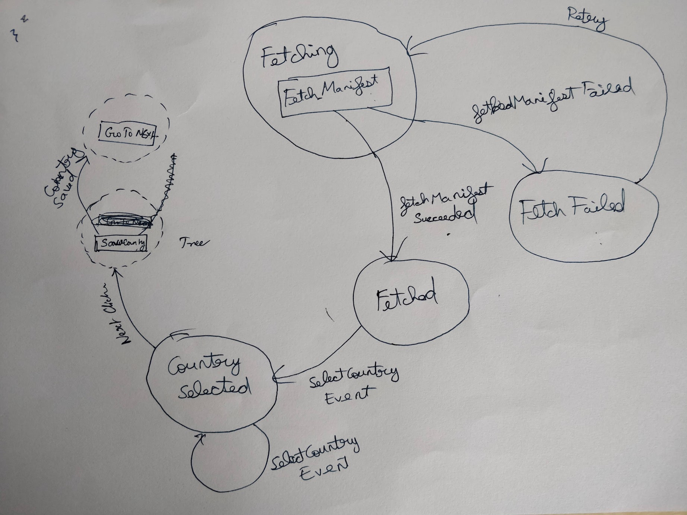
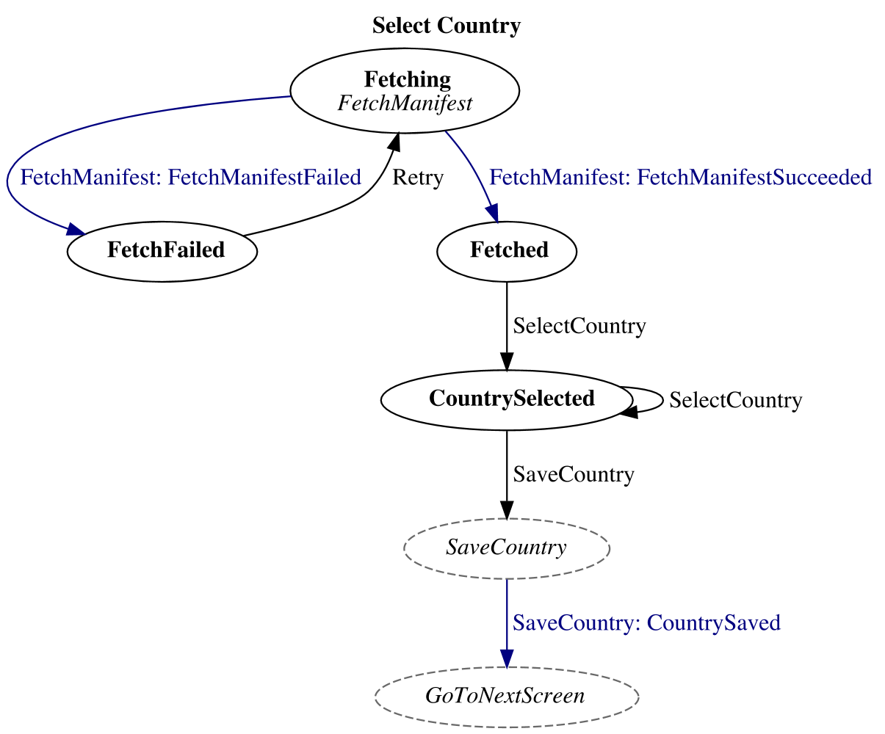
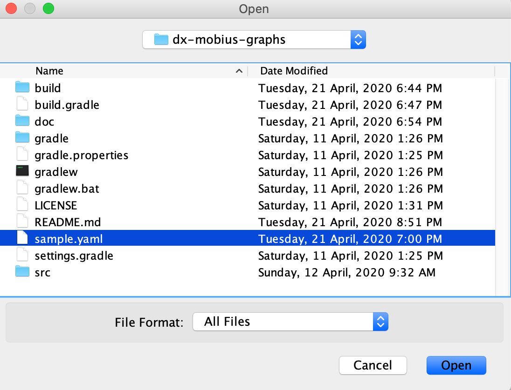
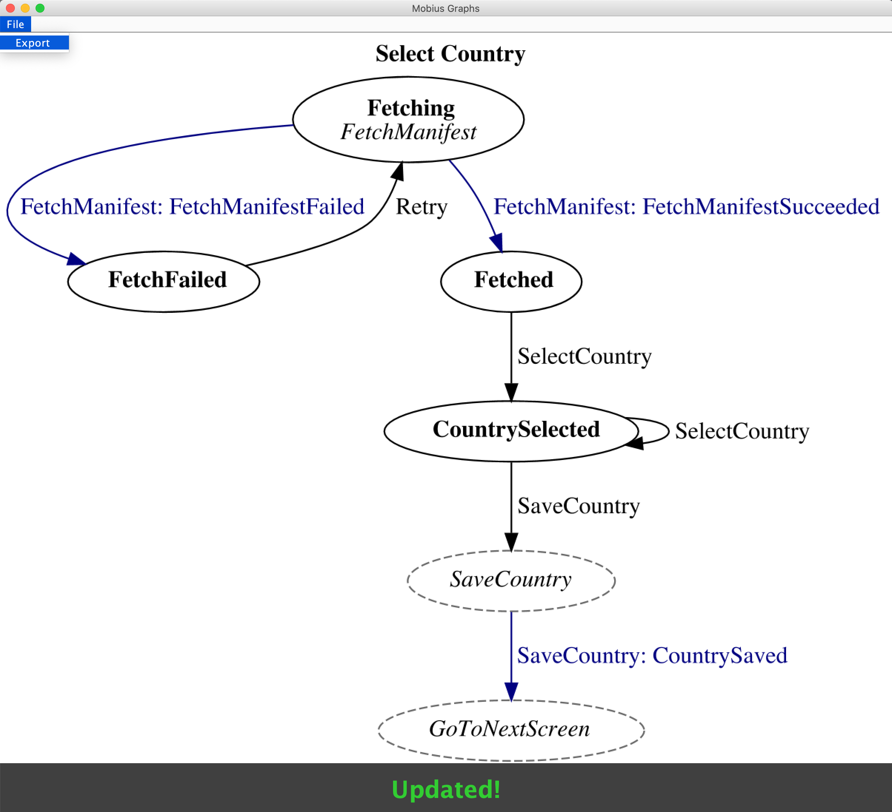

# dx-mobius-graphs

At [Obvious](https://obvious.in), we use [Mobius](https://github.com/spotify/mobius), a framework by [Spotify](https://www.spotify.com/), to build our Android apps. As part of this, we draw state machines that describe the flow of a "screen" along with all the events that can cause the state of the screen to change. 

Following is an example of a hand-drawn state machine for a feature in [Simple](https://github.com/simpledotorg/simple-android), an app that we build.



While this conveys the information, it has a couple of problems:

- Hand drawn graphs are hard to correct in the event of a mistake.
- They are also hard to change as the feature itself changes.

What we needed was a way to describe the state machine in a developer friendly text-based file that could be checked into the codebase and then generate a visual graph using that file.

This tool enables us to do that. Following is a description of the same feature using a YAML spec.

```yaml
name: Select Country
graph:
  Fetching:
    effects:
      - FetchManifest:
          events:
            - FetchManifestFailed: FetchFailed
            - FetchManifestSucceeded: Fetched
  FetchFailed:
    events:
      - Retry: Fetching
  Fetched:
    events:
      - SelectCountry: CountrySelected
  CountrySelected:
    events:
      - SelectCountry: CountrySelected
      - SaveCountry: _SaveCountry
  _SaveCountry:
    effects:
      - SaveCountry: 
          events:
            - CountrySaved: _GoToNext
  _GoToNext:
    effects:
      - GoToNextScreen:
          events: []
```

This tool is able to parse the YAML to generate a visual graph like so.



## Usage
- Download the latest JAR from the [releases](https://github.com/obvious/dx-mobius-graphs/releases) section.
- Run the tool using the following command:

```shell script
java -jar /path/to/dx-mobius-graphs-{version}.jar
```

- The tool will open a file-picker that you can point to the YAML file.



- The tool with observe the file for changes and continuously re-render the graph on modifications.

- When you are done, you can export the rendered image as either an SVG or PNG using the `File -> Export` menu.


## YAML structure
It is recommended to be familiar with the [Mobius concepts](https://github.com/spotify/mobius/wiki/Concepts) before proceeding.

The YAML structure currently has two parts:

### Name
This is the overall name of the feature and is represented as a string with the key `name`

```yaml
name: Select Country
```

### Graph
This is the structure that represents the changes in the state of the feature. This is represented by a key, `graph`, that has as its children, a list of different states the model could exist in.

```yaml
graph:
  Fetching:
  FetchFailed:
  Fetched:
  CountrySelected:
  _SaveCountry:
  _GoToNext:
```

We currently support two kinds of states:

- **Concrete:** These are states which actually result in a change in the model.
- **Intermediate:** These are states which do not result in a change in the model, but only trigger one or more effects. They are defined in the graph by prefixing the name of the state with an `_`.

#### Effects
Effects are originated from a state. A *Concrete* state may have  0 or more effects, while an *Intermediate* state must have at least one effect.

An effect can also result in one or more [events](#events).

```yaml
Fetching:
    effects:
      - FetchManifest:
          events:
            - FetchManifestFailed: FetchFailed
            - FetchManifestSucceeded: Fetched
_SaveCountry:
    effects:
      - SaveCountry: 
          events:
            - CountrySaved: _GoToNext
  _GoToNext:
    effects:
      - GoToNextScreen:
          events: []
```

#### Events 

States are linked by events, i.e., the only way to move from one state to another is via an event.

An event is represented as a key-value pair where the key is the name of the event and the value is the state to which it moves.

```yaml
FetchManifestFailed: FetchFailed
```

In addition, the graph supports two sources of events:

- **External:** These are events that are generated outside the Mobius loop, generally UI events like button clicks, etc.
- **Internal:** These are events that are generated inside the Mobius loop as a result of an effect

The tool decides whether or not an event is internal by examining the parent of the `events` key. If the parent is an effect, it treats the event as an internal one and colours it differently (blue in the above image). Otherwise, if the parent is a state, it colours the edge black.

```yaml
FetchFailed:
    events:
      - Retry: Fetching
```

## Roadmap
- Replace the YAML file input with something that is nicer for representing our needs, maybe a DSL?
- Be able to generate a code scaffold for the model, events, and effects.